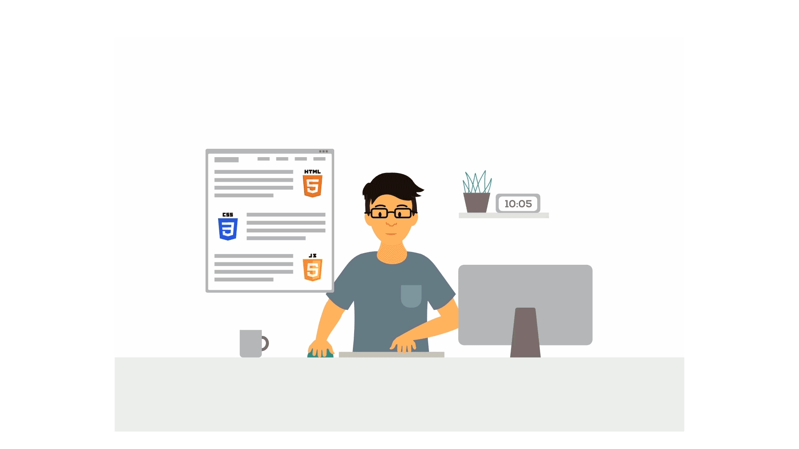
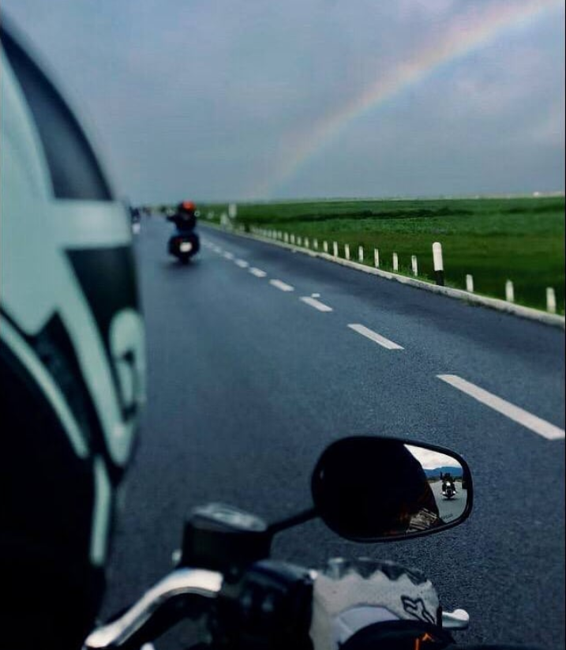

# WhatIsFrontEnd

## Bienvenidos Explorers!

Estas entrando en tu misión de FrontEnd!

En esta misión veremos la mágia de cómo funcionan las aplicaciones y es tu introducción a la programación Web en su camino a convertirse en programadores FullStack.

## Yo mero comandero

Podrías llegar a preguntarte que quién soy y por qué estoy como Mision Comander de esta primera edición, pues dejame presentarme y conozcámonos.

Me llamo Rodrigo Martínez y así como tu, amo la tecnología y todo lo que tiene que ver con crear cosas usando la imaginación como dicen por ahí si lo puedes imaginar lo puedes programar! *(Grande ATS!)*

Tengo experiencia de más de 8 años metido en el mundo de la tecnología y durante este tiempo he visto muchísimas cosas diferntes y trabajado con un montón de tecnologías y soy especialista en todo el tema de desarrollo web y ciberseguridad, lo cual lo he juntado durante los años para tener experiencia en el desarrollo de software seguro y esto me ha llevado a trabajar con bancos, instituciones financieras, gobierno e incluso con la policía y todo con la finalidad de utilizar la tecnología para CAMBIAR EL MUNDO.

Y que mejor forma de cambiar el mundo que enseñando porque como siempre digo **Lo mejor que puedes hacer con el conocimiento es COMPARTIRLO**

Aunque en mi vida no solo hay tecnología...

El hecho de ser Mision Comander no quita que me gusten las cosas bonitas de la vida

Me encanta viajar! y AMO con todo mi corazón andar en moto

Así como también adoro a mi perro Dobel (Ya lo conocerán durante el viaje)

Pero basta de hablar de mi y empecemos con el curso...

## Organización de MISIÓN FRONTEND

El curso tiene 8 módulos que tienen dentro varios subtemas que iremos viendo conforme avance el curso

1. Programación FrontEnd
    - ¿Qué es la programación FRONTEND?
	- ¿Para que sirve la programación FRONTEND?
	- En qué consiste la programación FRONTEND
	- Tecnologías aplicadas
	- SETUP de programación Web
	- Estructura de páginas web
	- Estructura y limpieza de código

2. Primer elemento de la lista
    - ¿Qué es HTML?
	- Estructura de archivo HTML
	- Sintaxis de etiquetas
	- Titulos / Headings
	- Parrafos / Paragraphs
	- Imágenes / Images
	- Enlaces / Links
	- Tablas / Tables
	- Listas / Listas
	- Entradas / Input
	- Botón / Button
	- Formularios / Forms
	- Rutas / Routes
	- Acomodo / Layout
	- Barra de navegación / NavBar - SideBar
	- Pie de página / Footer
	- Filas y columnas / Rows & Columns
	- Propiedades de etiquetas / Properties
	- Práctica de HTML

3. CSS
    - ¿Qué es CSS?
	- Selectores / Selector
	- Colores
	- Fondos / Background
	- Textos y fuentes
	- Enlaces y botones / Links
	- Acomodo / Box model
	- Responsive
	- Media Queries
	- Grid
	- Flexbox
	- Librerías de CSS
	- Práctica de CSS

4. JavaScript
    - ¿Qué es JS?
	- Variables, tipos y operadores
	- Estructura de programación
	- Funciones
	- Estructuras de datos
	- Objetos
	- Excepciones
	- Programación Asincrona
	- JS en el navegador
	- DOM (Document Object Model
	- Eventos
	- Consumo de APIs
	- Librerías y paquetes de JS
	- Práctica de JS

5. Vue JS
    - ¿Qué es VueJS?
	- Setup de VueJS
	- Estructura de archivos y proyecto
	- Estilos globales
	- Componentes
	- Eventos
	- Métodos
	- Rutas
	- JSON Server
	- Práctica de Vue

6. VUEX
    - ¿Qué es VUEX?
	- Patrón de manejo de estado
	- Setup
	- Estado / State
	- Getters
	- Mutaciones
	- Acciones
	- Módulos
	- Práctica VUEX

7. Angular
    - ¿Qué es Angular?
	- Prerequisitos y setup
	- Componentes
	- Plantillas
	- Inyección de dependencias
	- Angular CLI
	- Aplicación de ejemplo 
	- Práctica de Angular
	- Despliegue de aplicación

8. Azure
    - Azure Static Web App
	- Setup
	- Github Actions
	- Mantenimiento de tu aplicación

**Las diferentes ligas se irán desbloqueando durante el curso conforme pasen las semanas para que no se me adelanten**
